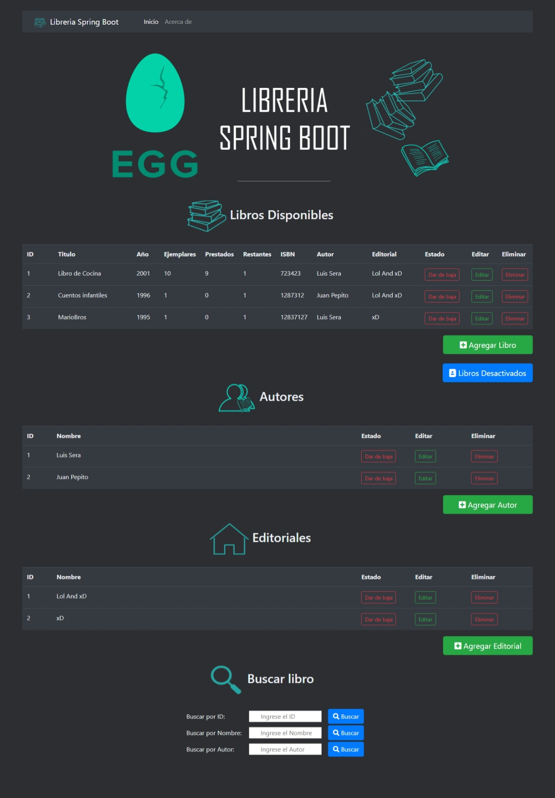

# Libreria Spring Boot EGG v1.0

## Vista previa del proyecto
-------

## Funciones
-------

1. Lee la base de datos MySQL y genera las tablas.
2. Permite agregar libros, autores y editoriales.
3. Permite editar y eliminar libros,autores y editoriales.
4. Re-uso de partes del html con la dependencia de thymeleaf.
5. Sistema de búsqueda de libros por id,nombre y autor.

## Como ejecutar el proyecto?

1. Descargar el zip del proyecto.
2. Ejecutar Libreria-MySQL-Estructura.sql desde el workbench para generar la base de datos "libreriamat" junto con todas las tablas y columnas.
3. Agregar el proyecto a netbeans y ejecutar
4. Ingresar a http://localhost:8080/
5. En caso de solicitar un usuario y contraseña, ambos son: root 

## Futuras caracteristicas

1. Sistema de login para iniciar sesion como usuario o admin
2. Sistema de prestamos para solicitar libros
3. Agregar una imagen a los libros?

## Soporte

Cualquier duda o reporte de bug/fallo hablarme al [Discord de EGG](https://discord.gg/x7YyZNAcnM) mi nick es - Matias Argüello -
